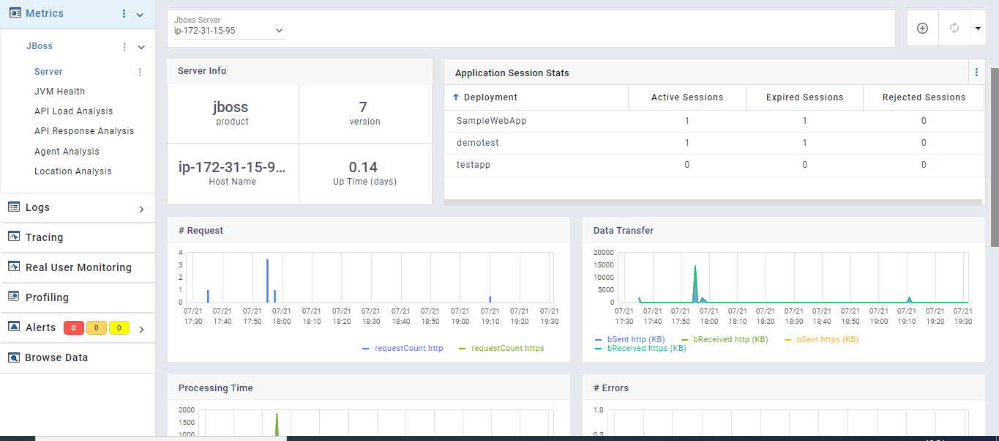
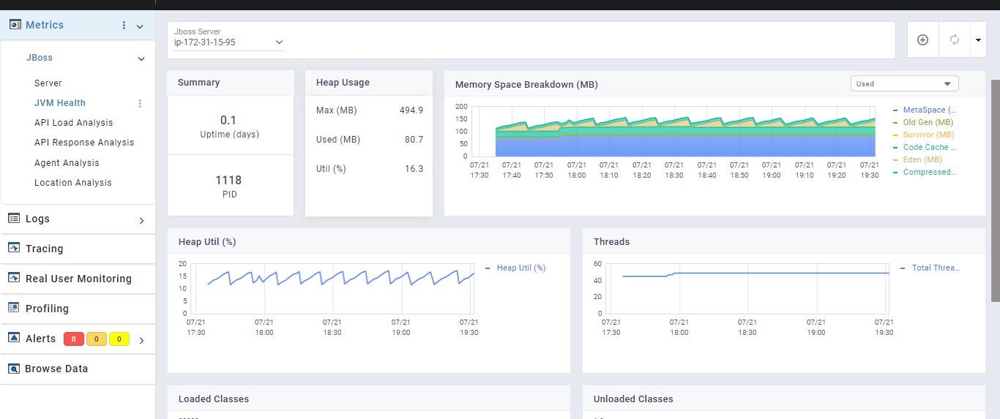

# Monitor JBoss Server

## Overview

Jboss Metric plugin monitors Jboss server by collecting multiple types of metrics like server stats, jvm stats using Jolokia.

## Prerequisites

- Jboss Metric Plugin is based on Jolokia agent which requires JMX monitoring to be enabled locally. Following property needs to be included during the start of jboss process

```
 -Dcom.sun.management.jmxremote
```

- JCMD command must be installed in the machine

## Configuration Settings

Refer to [sfAgent](/docs/sidebar-sf-selfhosted-turbo/Quick_Start/getting_started#sfagent) section for steps to install and automatically generate plugin configurations. User can also manually add the configuration shown below to `config.yaml` under `/opt/sfagent` directory . sfAgent supports multi domain monitoring. 

```yaml
metrics: 
  metrics: 
  plugins: 
    - name: jboss
      enabled: true
      interval: 30
      config:
       username: jbossuser
       password: password
       protocol: http
       port: 8080
       context: jolokia
```

## Documents

It consists of two document types:

- Jboss stats: contain metrics like jboss sever version, uptime, server name,transactions and session related details,request information like processing time, request count, data received and sent,processing time, request count, data received and sent
- JVM stats: contain all JVM related metrics used by tomcat server like garbage collection details, memory pools, loaded/unloaded classes etc

Use Jboss dashboard for data visualization.

### Server Info pane


### Jvm Health pane


### Api Load Analysis pane


## Logger

### Description

Jboss logger to capture Wildfly server access logs and error logs.

### Prerequisites

Jboss server access log format needs to be modified to capture all metrics from the access logs, which includes following steps. 

- Edit the file $JBOSS_HOME/standalone/configuration/standalone.xml or $JBOSS_HOME/domain/configuration/domain.xml in case of domain mode.

- Set log format in the following section `<host name="default-host" alias="localhost">` by specifying the pattern value to pre-defined “combined” log format or

```xml
<host name="default-host" alias="localhost">
    <location name="/" handler="welcome-content"/>
    <access-log pattern="%h %t &quot;%r&quot; %s &quot;%{i,User-Agent}&quot; %D " use-server-log="false"/>
    <http-invoker security-realm="ApplicationRealm"/>
</host>
```
- Set the attribute record-request-start-time="true" in the section `<subsystem xmlns="urn:jboss:domain:undertow:*">` for all the listeners as %D and %T access log elements will work only after record-request-start-time is turned on

- Set the attribute statistics-enabled="true" in all the occurences of standalone.xml as the statistics are disabled by default

- Restart wildfly service by executing the command

  ```
  service wildfly restart
  ```

After changing log pattern to combined or the above mentioned pattern, sample log would look like:

```
183.83.155.203 [07/Aug/2020:14:24:17 +0000] "GET /petclinic/org.richfaces.resources/javax.faces.resource/org.richfaces/skinning.ecss?db=eAG7dPvZfwAIqAOT HTTP/1.1" 500 "Mozilla/5.0 (Windows NT 10.0; Win64; x64) AppleWebKit/537.36 (KHTML, like Gecko) Chrome/84.0.4147.105 Safari/537.36" 3
```

:::note

If the access log format mentioned in the configuration is incorrect, a default parser is invoked to pick all the access logs.

::: 

## Configuration Settings

Mention the access log file and server log file path in plugin configuration. Wildcard character supported

```yaml
logging: 
  plugins: 
    - name: jboss-access
      enabled: true
      ## OPTIONAL
      config:
        log_path: "/opt/wildfly/<mode>/log/access*.log"   ## mode is domain or standalone
        geo_info: true
        ua_parser: true
        url_normalizer: false #Not recommended for k8s deployment
    - name: jboss-error
      enabled: true
      ## OPTIONAL
      config:
        log_level:
          - error
          - warn
          - warning
        log_path: "/opt/wildfly/<mode>/log/server*.log"   ## mode is domain or standalone
      ## If log format is incorrect
    - name: jboss-default-parser
      enabled: true
      log_path: "/opt/wildfly/<mode>/log/access*.log" ## mode is domain or standalone
```

Jboss access log plugin also supports:

  1. Geo-IP: Useful to find geographical location of the client using the IP address. To enable, set the option "geo_info" to true in the above configuration
  2. User-Agent Analysis: To get the host machine details like browser, Operating system and device by analysis the user-agent. To enable, set the option "ua_parser" to true in the above configuration. If enabled, by default it runs on port 8586
  3. URL Normalizer (not supported in container deployment): Normalize incoming URL paths. To enable, set the option "url_normalizer" to true in the above configuration. If enabled, by default it runs on port 8587


Config Field Description,

*interval*: Normalization algorithm runtime interval

*enabled*: Rely on normalization feature for rule generation

*rules_length_limit Normalization specific configuration is available in /opt/sfagent/normalization/config.yaml which resonate the following,

```yaml
interval: 300 
dynamic_rule_generation: 
    enabled: true
    rules_length_limit: 1000
    log_volume: 100000
rules: []
```
t*: Limit over size of generated rules. set the value to -1  for specifying no limit

*log_volume*: Limit over number of logs processed. set the value to -1  for specifying no limit

*rules*: Rules Generated

Recommended Approach is to have sfagent running with *dynamic_rule_generation* enabled over a period of time. Observe whether rules generated reflect all the web app requests intended to be normalized and if its a true reflection, set *enabled* flag to *false* , indicating no further rules will be generated

Default ports used by user-agent analysis and URL Normalizer can be changed respectively with the inclusion of following in config.yaml

```yaml
agent: 
    uaparserport: desired_port_number
    url_normalizer: desired_port_number
```

:::note
1. Latitude and Longitude are often near the center of population. These values are not precise and should not be used to identify a particular address or household
2. User-agent parsing requires high computation power. Recommended to enable only if needed and system have enough CPU resource available. Please refer the following table to know the CPU consumption range. These are **approximate values**, and **might vary** depending on multiple factors
:::


| Average Request Rate (request/sec) | Approx. CPU Utilization (%) |
| ---------------------------------- | --------------------------- |
| 50                                 | 4 - 7                       |
| 100                                | 12 - 15                     |
| 200                                | 30 - 60                     |
| 300                                | 40 - 60                     |
| 500                                | 50 - 80                     |
| 1000                               | 80 - 140                    |
| 2000                               | 90 - 160                    |


## Viewing data and dashboards 

Data collected by plugins can be viewed in SnappyFlow’s browse data section under metrics section 

`plugin: jboss, jboss-access, jboss-error`

`documentType: jboss, jvm, jboss-access, jboss-error`

Dashboard template: `jboss`


For help with plugins, please reach out to [support@snappyflow.io](mailto:support@snappyflow.io).